

# Overview

This is the second project of Udacity DevOps Engineer for Microsoft Azure Nanodegree Program.

This project builds a CI pipeline using GitHub Actions and a CD pipeline using Azure Pipelines for a Python-based machine learning application.

## Project Plan
<TODO: Project Plan

* A link to a Trello board for the project
* A link to a spreadsheet that includes the original and final project plan>

## Instructions

* Architectural Diagram (Shows how key parts of the system work)

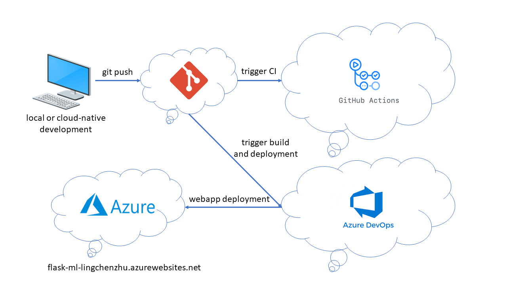

* Project cloned into Azure Cloud Shell

    * Open Azure Cloud Shell, create a SSH key pair by: `ssh-keygen -t rsa`;

    * Copy and paste the public SSH key to github.com (e.g., the file `~/.ssh/id_rsa.pub`);

    * Run `git clone git@github.com:zhulingchen/nd082-Azure-Cloud-DevOps-Starter-Code.git` to clone the repository into Azure Cloud Shell:

        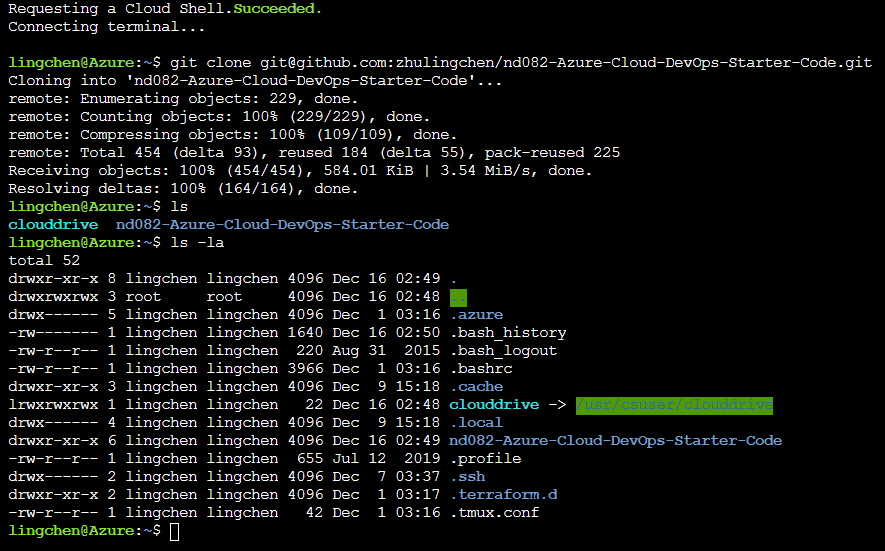

* Project running on Azure Webapp Service

    * Go to the project directory: `cd "nd082-Azure-Cloud-DevOps-Starter-Code/C2-Agile Development with Azure/project/starter_files/flask-sklearn"`;

    * Run the Azure Webapp Service up bash script `./commands.sh` or directly run `az webapp up --sku F1 --name flask-ml-lingchenzhu --location "East US"`;

    * Wait until the webapp infrastructure is created and verify the frontend:

        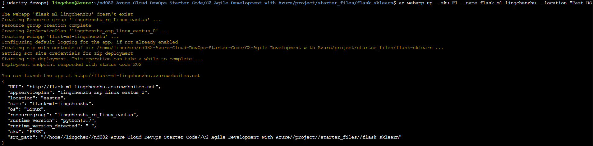

        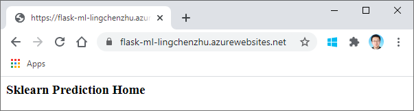

    * Update [make_predict_azure_app.sh](make_predict_azure_app.sh) to include the webapp name `flask-ml-lingchenzhu` in the POST target line

* Passing tests that are displayed after running the `make all` command from the `Makefile`

    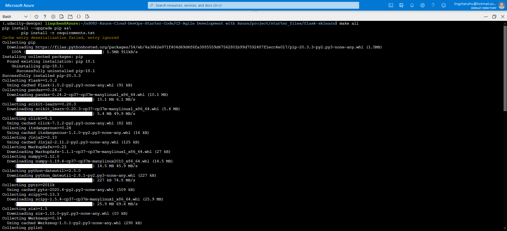

    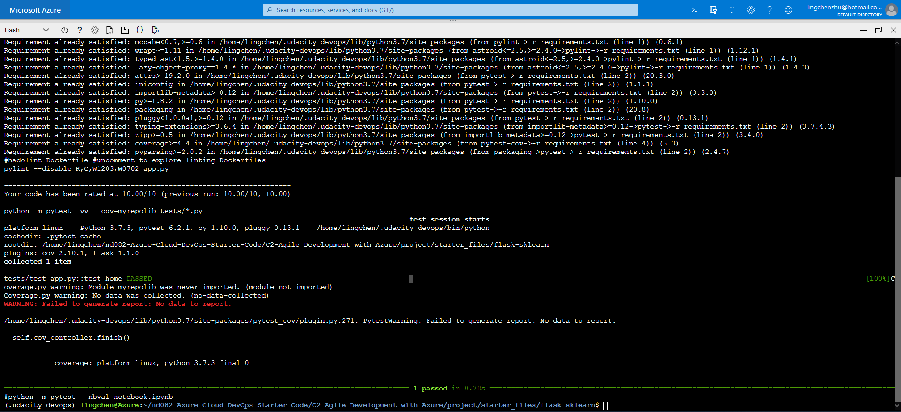

* Output of a test run

    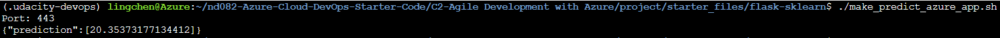

* Successful deploy of the project in Azure Pipelines.  [Note the official documentation should be referred to and double checked as you setup CI/CD](https://docs.microsoft.com/en-us/azure/devops/pipelines/ecosystems/python-webapp?view=azure-devops)

    * Create a new service connection to Azure Webapp Service

        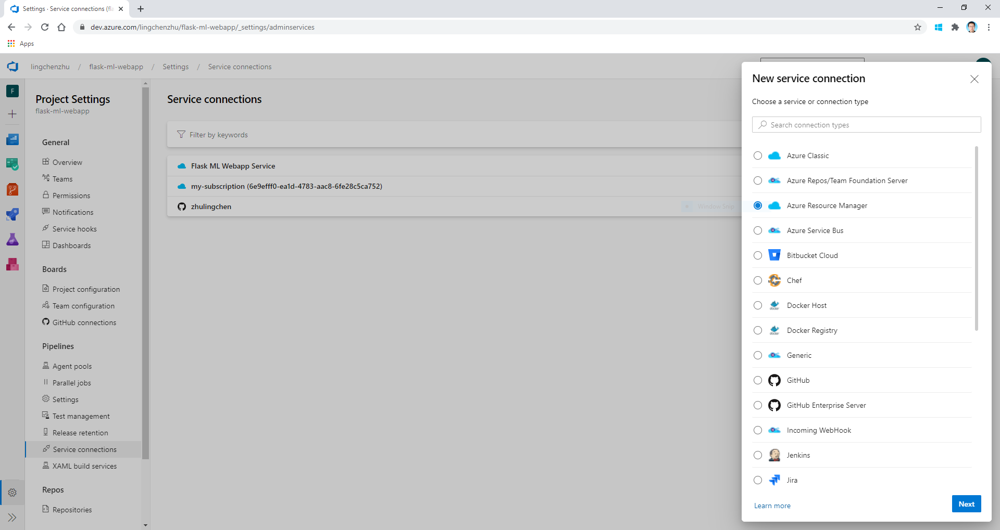

        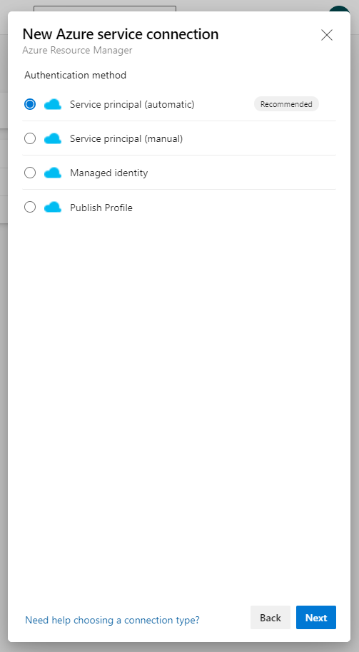

        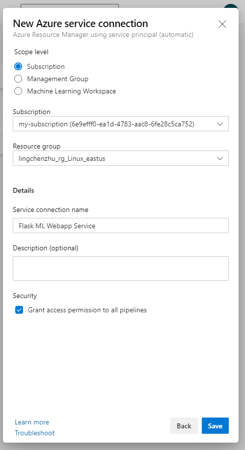

    * Checkout the Azure Pipelines configuration yaml file: [azure-pipelines.yml](../../../../azure-pipelines.yml)

* Running Azure App Service from Azure Pipelines automatic deployment

    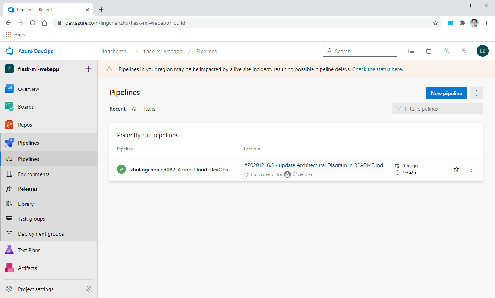

    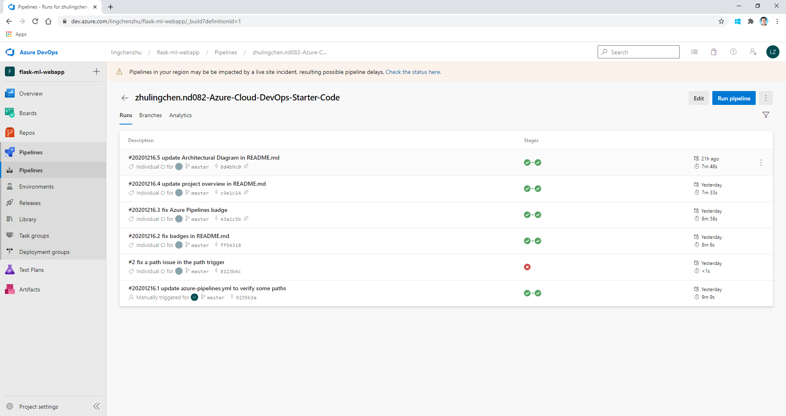

    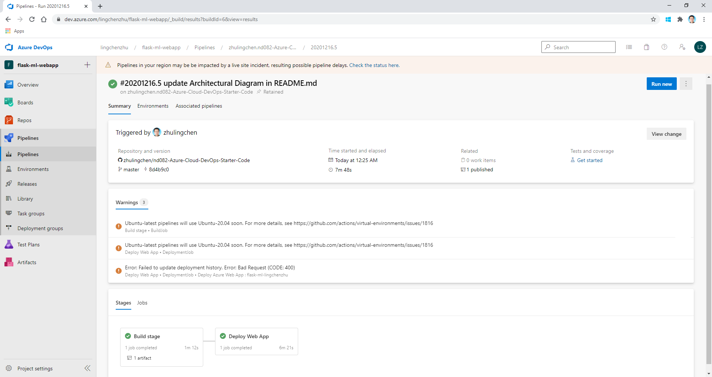

    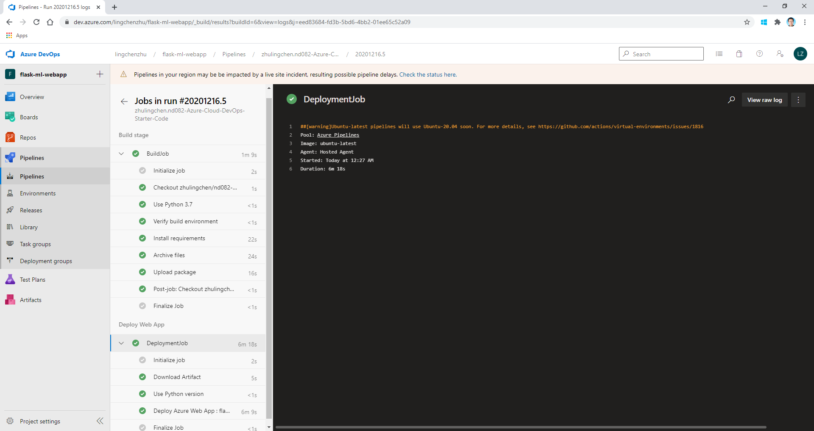

* Successful prediction from deployed flask app in Azure Cloud Shell.  [Use this file as a template for the deployed prediction](https://github.com/udacity/nd082-Azure-Cloud-DevOps-Starter-Code/blob/master/C2-AgileDevelopmentwithAzure/project/starter_files/flask-sklearn/make_predict_azure_app.sh).
The output should look similar to this:

    * Run the prediction script `./make_predict_azure_app.sh` after the webapp is online.

        

* Output of streamed log files from deployed application

    * Find the id of the deployed webapp by: `az webapp list`:

        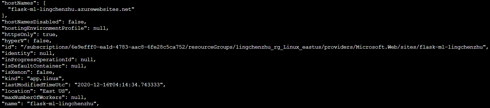

    * Start live log tracing for a webapp by:
        
        `az webapp log tail --ids /subscriptions/6e9efff0-ea1d-4783-aac8-6fe28c5ca752/resourceGroups/lingchenzhu_rg_Linux_eastus/providers/Microsoft.Web/sites/flask-ml-lingchenzhu`

    * Get the zipped streamed log output files for a webapp by:
        
        `az webapp log download --ids /subscriptions/6e9efff0-ea1d-4783-aac8-6fe28c5ca752/resourceGroups/lingchenzhu_rg_Linux_eastus/providers/Microsoft.Web/sites/flask-ml-lingchenzhu`

        * Downloaded logs to webapp_logs.zip

## Enhancements

<TODO: A short description of how to improve the project in the future>

## Demo 

<TODO: Add link Screencast on YouTube>

